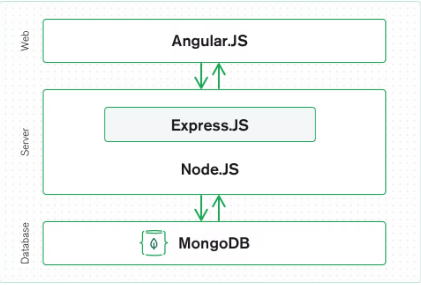
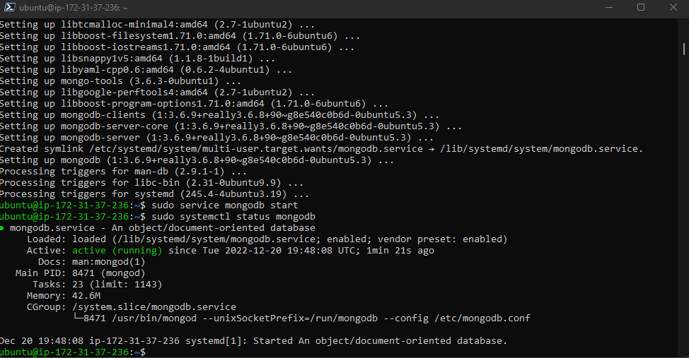
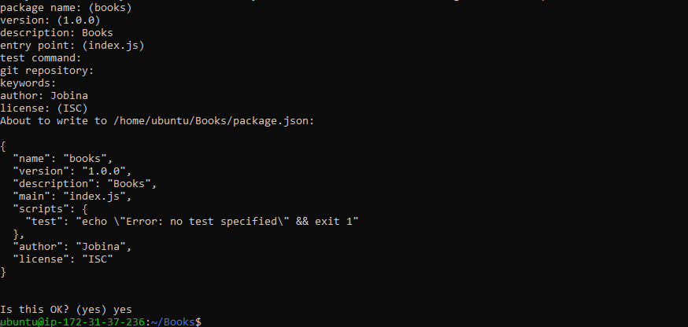
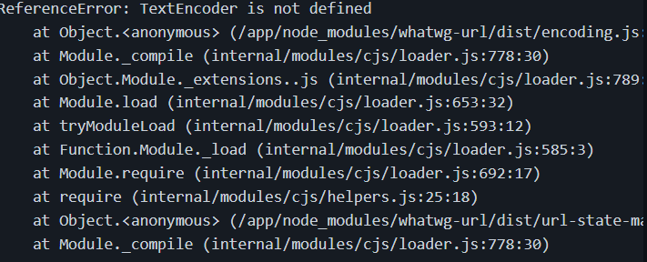
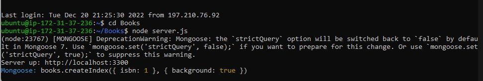
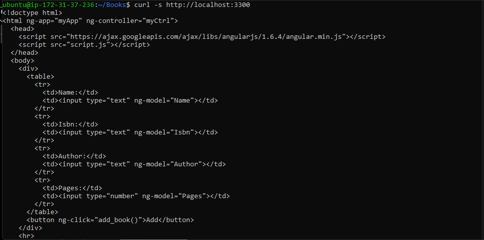
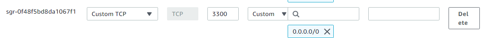
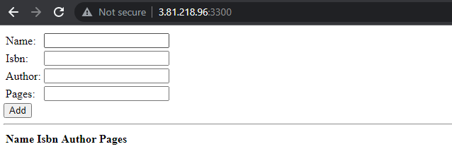
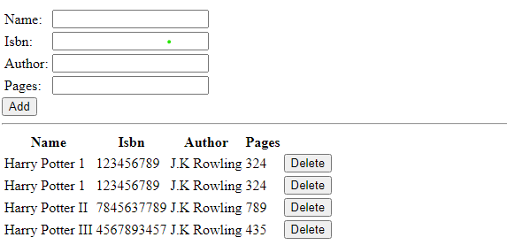
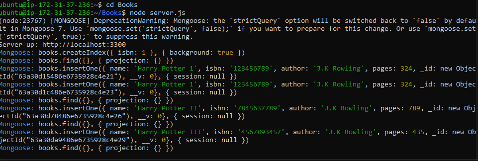

# MEAN-STACK

# What is the MEAN stack?

The MEAN stack is a JavaScript-based framework for developing web applications. MEAN is named after MongoDB, Express, Angular, and Node, the four key technologies that make up the layers of the stack.

- [MongoDB](https://www.mongodb.com/) — document database
- [Express(.js)](https://expressjs.com/) — Node.js web framework
- [Angular(.js)](https://angular.io/) — a client-side JavaScript framework
- [Node(.js)](https://nodejs.org/en/) — the premier JavaScript web server

# How does the MEAN stack work?
MEAN stack architecture

The MEAN architecture is designed to make building web applications in JavaScript and handling JSON incredibly easy.




# Overview 
 Implementing a simple Book Register web form using MEAN stack.

 # Prerequisites
 - AWS Account
 - Basic knowledge of setting up an Ec2 instance.
 - Connecting to Ec2 instance
 
 
# Step 1:
create a new EC2 Instance of t2.micro family with an Ubuntu Server 20.04 LTS (HVM) image.
[Connect with putty here](https://github.com/Jobijollof/PUTTY)

# Step 2: Install NodeJs
Node.js is a JavaScript runtime built on Chrome’s V8 JavaScript engine. Node.js is used in this tutorial to set up the Express routes and AngularJS controllers.

- Update Ubuntu

`sudo apt update`

- Upgrade ubuntu

`sudo apt upgrade`

- Add certificates

```
sudo apt -y install curl dirmngr apt-transport-https lsb-release ca-certificates
 
curl -sL https://deb.nodesource.com/setup_12.x | sudo -E bash -

```

- Install NodeJS

`sudo apt install -y nodejs`

# Step 3: Install MongoDB
MongoDB stores data in flexible, JSON-like documents. Fields in a database can vary from document to document and data structure can be changed over time. For our example application, we are adding book records to MongoDB that contain book name, isbn number, author, and number of pages.
mages/WebConsole.gif

```
sudo apt-key adv --keyserver hkp://keyserver.ubuntu.com:80 --recv 0C49F3730359A14518585931BC711F9BA15703C6
echo "deb [ arch=amd64 ] https://repo.mongodb.org/apt/ubuntu trusty/mongodb-org/3.4 multiverse" | sudo tee /etc/apt/sources.list.d/mongodb-org-3.4.list

```

- Install MongoDB

`sudo apt install -y mongodb`

- Start The server

`sudo service mongodb start`

- Verify that the service is up and running

`sudo systemctl status mongodb`



- Install npm – Node package manager.

`sudo apt install -y npm`

Install [body-parser](https://www.npmjs.com/package/body-parser) package
We need ‘body-parser’ package to help us process JSON files passed in requests to the server.

- Create a folder named ‘Books’

`mkdir Books && cd Books`

- In the Books directory, Initialize npm project

`npm init`

- Click on enter several times and fill out the parameters and finally click on yes.



- Add a file to it named server.js

`touch server.js`

`nano server.js`

- Copy and paste the following code into ***server.js*** file

```
var express = require('express');
var bodyParser = require('body-parser');
var app = express();
app.use(express.static(__dirname + '/public'));
app.use(bodyParser.json());
require('./apps/routes')(app);
app.set('port', 3300);
app.listen(app.get('port'), function() {
    console.log('Server up: http://localhost:' + app.get('port'));
});

```

# Step 4: Install Express and set up routes to the server
[Express](https://expressjs.com/) is a minimal and flexible Node.js web application framework that provides features for web and mobile applications. We will use Express to pass book information to and from our MongoDB database.
We also will use [Mongoose](https://mongoosejs.com/) package which provides a straightforward, schema-based solution to model your application data. We will use Mongoose to establish a schema for the database to store data of our book register.

`sudo npm install express mongoose`

In ‘Books’ directory, create a folder named apps

`mkdir apps && cd apps`

- Create a file named ***routes.js***

`touch routes.js`

`nano routes.js`

- Copy and paste the following code

```
var Book = require('./models/book');
module.exports = function(app) {
  app.get('/book', function(req, res) {
    Book.find({}, function(err, result) {
      if ( err ) throw err;
      res.json(result);
    });
  }); 
  app.post('/book', function(req, res) {
    var book = new Book( {
      name:req.body.name,
      isbn:req.body.isbn,
      author:req.body.author,
      pages:req.body.pages
    });
    book.save(function(err, result) {
      if ( err ) throw err;
      res.json( {
        message:"Successfully added book",
        book:result
      });
    });
  });
  app.delete("/book/:isbn", function(req, res) {
    Book.findOneAndRemove(req.query, function(err, result) {
      if ( err ) throw err;
      res.json( {
        message: "Successfully deleted the book",
        book: result
      });
    });
  });
  var path = require('path');
  app.get('*', function(req, res) {
    res.sendfile(path.join(__dirname + '/public', 'index.html'));
  });
};

```

- In the ‘apps’ directory, create a directory named models

`mkdir models && cd models`

- Create a file named ***book.js***

`touch book.js`

`nano book.js`

- Copy and paste into the book.js file

```
var mongoose = require('mongoose');
var dbHost = 'mongodb://localhost:27017/test';
mongoose.connect(dbHost);
mongoose.connection;
mongoose.set('debug', true);
var bookSchema = mongoose.Schema( {
  name: String,
  isbn: {type: String, index: true},
  author: String,
  pages: Number
});
var Book = mongoose.model('Book', bookSchema);
module.exports = mongoose.model('Book', bookSchema);

```

# Step 5:  Access the routes with [AngularJS](https://angularjs.org/)

AngularJS provides a web framework for creating dynamic views in your web applications. In this tutorial, we use AngularJS to connect our web page with Express and perform actions on our book register.

- Change the directory back to ‘Books’

`cd ../..`

- Create a directory named ***public***

`mkdir public && cd public`

- Add a file named ***script.js***

`touch script.js`

`nano script.js`

- Copy and paste the Code below (controller configuration defined) into the ***script.js*** file

```
var app = angular.module('myApp', []);
app.controller('myCtrl', function($scope, $http) {
  $http( {
    method: 'GET',
    url: '/book'
  }).then(function successCallback(response) {
    $scope.books = response.data;
  }, function errorCallback(response) {
    console.log('Error: ' + response);
  });
  $scope.del_book = function(book) {
    $http( {
      method: 'DELETE',
      url: '/book/:isbn',
      params: {'isbn': book.isbn}
    }).then(function successCallback(response) {
      console.log(response);
    }, function errorCallback(response) {
      console.log('Error: ' + response);
    });
  };
  $scope.add_book = function() {
    var body = '{ "name": "' + $scope.Name + 
    '", "isbn": "' + $scope.Isbn +
    '", "author": "' + $scope.Author + 
    '", "pages": "' + $scope.Pages + '" }';
    $http({
      method: 'POST',
      url: '/book',
      data: body
    }).then(function successCallback(response) {
      console.log(response);
    }, function errorCallback(response) {
      console.log('Error: ' + response);
    });
  };
});

```
- In the public folder, create a file named ***index.html***;

`touch index.html`

- Copy and paste the code below into ***index.html*** file

```
<!doctype html>
<html ng-app="myApp" ng-controller="myCtrl">
  <head>
    <script src="https://ajax.googleapis.com/ajax/libs/angularjs/1.6.4/angular.min.js"></script>
    <script src="script.js"></script>
  </head>
  <body>
    <div>
      <table>
        <tr>
          <td>Name:</td>
          <td><input type="text" ng-model="Name"></td>
        </tr>
        <tr>
          <td>Isbn:</td>
          <td><input type="text" ng-model="Isbn"></td>
        </tr>
        <tr>
          <td>Author:</td>
          <td><input type="text" ng-model="Author"></td>
        </tr>
        <tr>
          <td>Pages:</td>
          <td><input type="number" ng-model="Pages"></td>
        </tr>
      </table>
      <button ng-click="add_book()">Add</button>
    </div>
    <hr>
    <div>
      <table>
        <tr>
          <th>Name</th>
          <th>Isbn</th>
          <th>Author</th>
          <th>Pages</th>
 
        </tr>
        <tr ng-repeat="book in books">
          <td>{{book.name}}</td>
          <td>{{book.isbn}}</td>
          <td>{{book.author}}</td>
          <td>{{book.pages}}</td>
 
          <td><input type="button" value="Delete" data-ng-click="del_book(book)"></td>
        </tr>
      </table>
    </div>
  </body>
</html>

```
- Change the directory back up to ***Books***

`cd ..`

- Start the server by running this command:

`node server.js`

- Once you run this command you will experience this error message. 



- This is because nodejs is outdated. We have version 10 installed. We would install version 12.

# Update system

As a norm, we work on an updated system to ensure we don’t have dependency issues.

`sudo apt update`

`sudo apt -y upgrade`

 # Add Node.js APT Repository

 All releases of Node.js are derivable from the official APT repository. However, this needs to be added to your system manually

 ```
 sudo apt -y install curl dirmngr apt-transport-https lsb-release ca-certificates
curl -sL https://deb.nodesource.com/setup_12.x | sudo -E bash -

```

# Install ***Node.js 12*** on Ubuntu 

`sudo apt -y install nodejs`

- Confirm Node.js 12 installation by checking the version installed.

- node --version

Run `node server.js` again.



The server is now up and running, we can connect it via port 3300. You can launch a separate Putty or SSH console to test what the curl command returns locally.

`curl -s http://localhost:3300`



It shall return an HTML page, it is hardly readable in the CLI, but we can also try and access it from the Internet.
For this – you need to open TCP port 3300 in your AWS Web Console for your EC2 Instance.



Now you can access our Book Register web application from the Internet with a browser using a Public IP address or Public DNS name.

A quick reminder on how to get your server’s Public IP and public DNS name:
You can find it in your AWS web console in EC2 details. Run:

`http://<Public-Ip>:3300`

This is how your WebBook Register Application will look in the browser:



- Populate the WebBook register:

- Click on add 

- Refresh



- Mongoose (database) will also be populated




🌟🌟🌟🌟🌟🌟🌟🌟🌟🌟🌟


