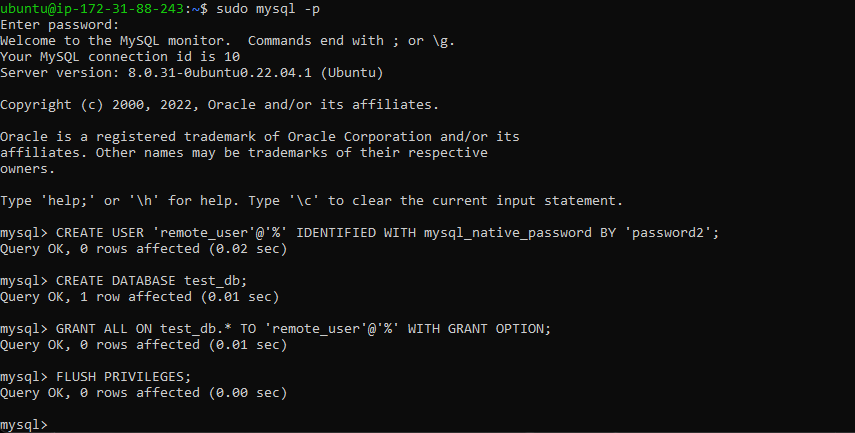

# Client-server-Architecture-Msql
## Understanding Client-Server Architecture

Client-Server refers to an architecture in which two or more computers are connected together over a network to send and receive requests between one another.
In their communication, each machine has its own role: the machine sending requests is usually referred as "Client" and the machine responding (serving) is called "Server".
A simple diagram of Web Client-Server architecture is presented below:

In the example above, a machine that is trying to access a Web site using a Web browser or simply ‘curl’ command is a client and it sends HTTP requests to a Web server (Apache, Nginx, IIS or any other) over the Internet.
If we extend this concept further and add a Database Server to our architecture, we can get this picture:

In this case, our Web Server has a role of a "Client" that connects and reads/writes to/from a Database (DB) Server (MySQL, MongoDB, Oracle, SQL Server or any other), and the communication between them happens over a Local Network (it can also be an Internet connection, but it is a common practice to place Web Server and DB Server close to each other in a local network).

# Implementing a Client Server Architecture using MySQL Database Management System (DBMS).

## Step 1:

- Create and configure two Linux-based virtual servers (EC2 instances in AWS)

- Server A name - mysql server

- Server B name - mysql client

### On  mysql server Linux Server install MySQL Server software with:

`sudo apt update`

`sudo apt upgrade`

`sudo apt install mysql-server -y`

- To check mysql status run

`sudo systemctl status mysql`

### On mysql client Linux Server install MySQL Server software with:

`sudo apt update`

`sudo apt upgrade`

`sudo apt install mysql-client`

By default, both of your EC2 virtual servers are located in the same local virtual network, so they can communicate to each other using local IP addresses. Use mysql server's local IP address to connect from mysql client. MySQL server uses TCP port 3306 by default, so you will have to open it by creating a new entry in ‘Inbound rules’ in ‘mysql server’ Security Groups. For extra security, do not allow all IP addresses to reach your ‘mysql server’ allow access only to the specific local IP address of your ‘mysql client’.

For mysql client to gain remote access to mysql server we need to create a database and a user on mysql server.

`sudo mysql -p`

- Next, create the remote user with this following command: 

`CREATE USER 'remote_user'@'%' IDENTIFIED WITH mysql_native_password BY 'password';`

- Create database with: 

`CREATE DATABASE test_db;`

- Then grant privileges to remote_user: 

`GRANT ALL ON test_db.* TO 'remote_user'@'%' WITH GRANT OPTION;`

Finally, flush privileges and exit mysql :

`FLUSH PRIVILEGES;`

Having created the user and database, configure MySQL server to allow connections from remote hosts. Use the following command: 

`sudo nano /etc/mysql/mysql.conf.d/mysqld.cnf`

- In the text editor, replace the old Bind-address from ‘127.0.0.1’ to ‘0.0.0.0’ then save and exit. 

- Restart mysql with: 

`sudo systemctl restart mysql`

From mysql client connect remotely to mysql server Database Engine without using SSH. Using the mysql utility to perform this action Run:

`mysql -u remote_user -h 3.93.145.247 -p`

Note that the format is:

`mysql -u <user> -h <ipaddress-of-the-server> -p`

- This gives us access into the mysql server database engine.

- Finally  to show the test_db database that was created type: 

`Show databases;` 

