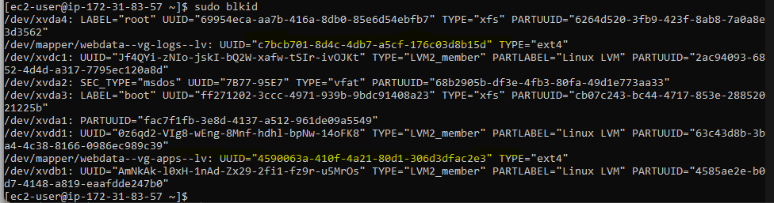

# implementing-websolution-usingwordpress
WEB SOLUTION WITH WORDPRESS

### Project Overview:

We are going  to prepare storage infrastructure on two Linux servers and implement a basic web solution using WordPress. WordPress is a free and open-source content management system written in [PHP](https://www.php.net/manual/en/intro-whatis.php) and paired with MySQL or MariaDB as its backend Relational Database Management System (RDBMS).
This Project  consists of two parts:

- Configure storage subsystem for Web and Database servers based on Linux OS. The focus of this part is to give you practical experience of working with disks, partitions and volumes in Linux.

-  Install WordPress and connect it to a remote MySQL database server.  As a DevOps Eng this part of the project is aimed at solidifying web deployment skill and DB tiers of Web solution.

Generally, web, or mobile solutions are implemented based on what is called the Three-tier Architecture.
Three-tier Architecture is a client-server software architecture pattern that comprise of 3 separate layers.


- Presentation Layer (PL): This is the user interface such as the client server or browser on your laptop.
- Business Layer (BL): This is the backend program that implements business logic. Application or Webserver
- Data Access or Management Layer (DAL): This is the layer for computer data storage and data access. Database Server or File System Server such as FTP server, or NFS Server.

### Requirements:

3-Tier Setup:

- A Laptop or PC to serve as a client
- An EC2 Linux Server as a web server (This is where you will install WordPress)
- An EC2 Linux server as a database (DB) server

Note: We are using RedHat OS for this project. Also when connecting to RedHat you will need to use ec2-user user. 
Connection string will look like:

ec2-user@Public-IP

## Step 1:

### Prepare a Web Server

- Launch an EC2 instance that will serve as "Web Server".

- Create 3 volumes  of 10 GiB each before you launch the server.

[volume](./images/volume.png)

- Open up the Linux terminal to begin configuration

To inspect what block devices are attached to the server Run:

`lsblk`


 Notice names of your newly created block devices:

1. xvdb
2. xvdc
3. xvdd

All devices in Linux reside in ***/dev/ directory***. Inspect it with 

`ls /dev/`

and make sure you see all 3 newly created block devices there


- To see all mounts and free space on your server Run:

`df -h`


Use ***gdisk*** utility to create a single partition on each of the 3 disks

### To create a single partition on the first disk run:

`sudo gdisk /dev/xvdb`


### To create a single partition on the second disk run:

`sudo gdisk /dev/xvdc`


### To create a single partition on the third  disk run:

`sudo gdisk /dev/xvdd`


Once again, Use ***lsblk*** utility to view the newly configured partition on each of the 3 disks.

`lsblk`


***Take note of Disk and Part*** Disks created, now been partitions.

It is on these partitions we are going to create physical volumes.

In Ubuntu we used ***apt*** command to install packages, in RedHat/CentOS a different package manager is used, called the ***yum*** command.

We are going to install ***lvm2*** package on the server so that it can be used to create a volume group etc

Logical volume management (LVM) is a form of storage virtualization that offers system administrators a more flexible approach to managing disk storage space than traditional partitioning. This type of virtualization tool is located within the device-driver stack on the operating system.

`sudo yum install lvm2 -y`


- To verify if Lvm was properly installed, run

`which lvm`


- To check for available partitions Run:

`sudo lvmdiskscan`


`sudo pvcreate /dev/xvdb1 /dev/xvdc1 /dev/xvdd1`


- To verify that the Physical volume has been created successfully run:

`sudo pvs`


We are going to use ***vgcreate utility*** to add all 3 PVs to a volume group (VG).
Name the VG (webdata-vg).
This literally means we are Creating  a volume group and adding the physical volumes to it.

- Run:

`sudo vgcreate vg-database /dev/xvdb1 /dev/xvdc1 /dev/xvdd1`


- To verify that the volume group has been created successfully run:

`sudo vgs`


Use ***lvcreate**** utility to create 2 logical volumes. 

`apps-lv` (Use half of the PV size), and 

`logs-lv` Use the remaining space of the PV size. 

NOTE: `apps-lv` will be used to store data for the Website while, `logs-lv` will be used to store data for logs

`sudo lvcreate -n apps-lv -L 14G webdata-vg`


`sudo lvcreate -n logs-lv -L 14G webdata-vg`


- To verify that the Logical Volume has been created successfully run:

`sudo lvs`


- To verify the entire setup run:

`sudo vgdisplay -v #view complete setup - VG, PV, and LV`


`sudo lsblk` 


Use ***mkfs.ext4*** to format the logical volumes with [ext4](https://en.wikipedia.org/wiki/Ext4) 
filesystem

`sudo mkfs.ext4 /dev/webdata-vg/apps-lv`


` sudo mkfs.ext4 /dev/webdata-vg/logs-lv`


### Creating a directory structure.

- Create ***/var/www/html*** directory to store website files.

`sudo mkdir -p /var/www/html`

- Create ***/home/recovery/logs*** to store backup of log data`sudo mkdir -p /home/recovery/logs`

`sudo mkdir -p /home/recovery/logs`

- Mount /var/www/html on ***apps-lv*** logical volume

`sudo mount /dev/webdata-vg/apps-lv /var/www/html/`


Use ***rsync*** utility to backup all the files in the log directory /var/log into /home/recovery/logs (This is required before mounting the file system)

`sudo rsync -av /var/log/. /home/recovery/logs/`


Mount /var/log on logs-lv logical volume. (Note that all the existing data on /var/log will be deleted. That is the reason for creating /home/recovery/logs to store website files)

`sudo mount /dev/webdata-vg/logs-lv /var/log`

- Restore log files back into /var/log directory

sudo rsync -av /home/recovery/logs/. /var/log


- To confirm recovery

`sudo ls -l /var/log`


### Updating the ***/ETC/FSTAB*** FILE

Update ***/etc/fstab*** file so that the mount configuration will persist after restart of the server.
The ***UUID*** of the device will be used to update the /etc/fstab file;

`sudo blkid`



`sudo vi /etc/fstab`

```
UUID=<uuid of your webdata-vg-apps> /var/www/html ext4 defaults 0 0
UUID=<uuid of your webdata-vg-logs> /var/log ext4 defaults 0 0

```


- To test the configuration and reload the daemon run:

`sudo mount -a`

`sudo systemctl daemon-reload`

If these two commands return any output,please go back to your configuration.

- To verify if  all setup is complete run:

`df -h`


### Step 2 : Prepare the Database Server

Launch a second RedHat EC2 instance that will have a role – ‘DB Server’
Repeat the same steps as for the Web Server, but instead of apps-lv create db-lv and mount it to /db directory instead of /var/www/html/.

- Launch an EC2 instance that will serve as "Web Server".

- Create 3 volumes  of 10 GiB each before you launch the server.

- Connect to the database server.

- Run

`lsblk`


`sudo gdisk /dev/xvdb`

`sudo gdisk /dev/xvdc` 

`sudo gdisk /dev/xvdb`

`lsblk`

`sudo yum install lvm2`

`sudo pvcreate /dev/xvdd1 /dev/xvdb1 /dev/xvdc1`

`sudo vgcreate vg-database /dev/xvdd1 /dev/xvdb1 /dev/xvdc1`

`sudo vgs`


Create logical volume db-lv only

`sudo lvcreate -n db-lv -L 20G vg-database`

`sudo lvs`


`sudo mkdir db`

`sudo mkfs.ext4 /dev/vg-database/db-lv`

`ls -l /db

`sudo mount /dev/vg-database/db-lv /db`


`df -h`


`sudo blkid`


`sudo vi /etc/fstab`


`sudo mount -a`

`sudo systemctl daemon-reload`

` df -h`

### Step 3 — Install WordPress on your Web Server EC2

- Update the repository

`sudo yum -y update`

- Install wget, Apache and it’s dependencies
 
`sudo yum -y install wget httpd php php-mysqlnd php-fpm php-json`

- Install the EPEL repository

`sudo dnf install https://dl.fedoraproject.org/pub/epel/epel-release-latest-8.noarch.rpm`

`sudo yum install php php-opcache php-gd php-curl php-mysqlnd`

`php -v`

- Start FastCGI processor

`sudo systemctl start php-fpm`

`sudo systemctl enable php-fpm`

`sudo systemctl status php-fpm`

`setsebool -P httpd_execmem 1`


`which httpd`

`sudo systemctl start httpd`

`sudo systemctl status httpd`

`sudo ls -l /var/www/html`


Grab the public IP address of the web server to test installation of Apache.


### Download wordpress and copy wordpress to var/www/html
 
`mkdir wordpress`
  
`cd   wordpress`

`sudo wget http://wordpress.org/latest.tar.gz`


`ls -l`
  


`sudo tar xzvf latest.tar.gz`


`sudo cp -R wp-config-sample.php wp-config.php`


`pwd` follow all the steps below:


`sudo cp -R wordpress/. /var/www/html/`

`sudo ls -l /var/www/html`


 

## Step 4 — Install MySQL on your DB and Web server Ec2
### On the web server install mysql server (This machine will be running as a client)
 

`sudo yum install mysql-server -y`

Verify that the service is up and running by using `sudo systemctl status mysqld` if it is not running, restart the service and enable it so it will be running even after reboot:

`sudo systemctl start mysqld`

`sudo systemctl enable mysqld`


`cd /var/www/html`

`sudo vi wp-config.php`

- Edit the configuration file 


DB_HOST=The private IP of the web server

`sudo systemctl restart httpd`

- Disable the Apache default page in order to view wordpress

`sudo mv /etc/httpd/conf.d/welcome.conf /etc/httpd/conf.d/welcome.conf_backup`

- To verify that the web server can communicate with the database server:

`sudo mysql -h {Private IP database} -u {user} -p `


- Configure SELinux Policies

- Configure SELinux Policies

`sudo chown -R apache:apache /var/www/html/`

`sudo chcon -t httpd_sys_rw_content_t /var/www/html/wordpress -R

`sudo setsebool -P httpd_can_network_connect=1`

`sudo setsebool -P httpd_can_network_connect_db 1`

### On the database server install mysql server

sudo yum install mysql-server -y`

Verify that the service is up and running by using `sudo systemctl status mysqld` if it is not running, restart the service and enable it so it will be running even after reboot:

`sudo systemctl start mysqld`

`sudo systemctl enable mysqld`

`sudo systemctl status mysqld`


`sudo mysql_secure_installation`


Type yes to all the prompts till you see all done!

`sudo mysql` 
This command should return an error.

 to gain access and also create a database run:

`sudo mysql -u root -p` (enter password)
  
- Enter password and create database like this:

`CREATE DATABASE wordpress;`

`CREATE USER `wordpress`@`%` IDENTIFIED WITH mysql_native_password BY 'wordpress';`

`GRANT ALL PRIVILEGES ON *.* TO 'wordpress'@'%' WITH GRANT OPTION;`

`FLUSH PRIVILEGES;`

`select user,host from mysqld;` (To check your connection)

`exit`


### Set the bind address.

`sudo vi /etc/my.cnf`


### Try to access from your browser the link to your WordPress http://<Web-Server-Public-IP-Address>


- Login and create a profile


  


