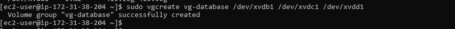

# Devops-Tooling-Website-Solution
As a member of a DevOps team, implementing a tooling website will be almost inevitable. A tooling website grants easy access to DevOps tools within the corporate infrastructure.
### Project Overview:
We want to introduce a set of DevOps tools that will help our team in day-to-day activities in managing, developing, testing, deploying and monitoring different projects.
The tools we want our team to be able to use are well-known and widely used by multiple DevOps teams,we would be introducing a single DevOps Tooling Solution that will consist of:
1. [Jenkins](https://www.jenkins.io/) – free and open source automation server used to build [CI/CD](https://en.wikipedia.org/wiki/CI/CD) pipelines.
2. [Kubernetes](https://kubernetes.io/) – an open-source container-orchestration system for automating computer application deployment, scaling, and management.
3. [Jfrog Artifactory](https://jfrog.com/artifactory/) – Universal Repository Manager supporting all major packaging formats, build tools and CI servers. Artifactory.
4. [Rancher](https://rancher.com/products/rancher/) – an open-source software platform that enables organizations to run and manage Docker[https://en.wikipedia.org/wiki/Docker_(software)] and Kubernetes in production.
[Grafana](https://grafana.com/) – a multi-platform open-source analytics and interactive visualization web application.
[Prometheus](https://prometheus.io/) – An open-source monitoring system with a dimensional data model, flexible query language, efficient time series database and modern alerting approach.
[Kibana](https://www.elastic.co/kibana) – Kibana is a free and open user interface that lets you visualize your [Elasticsearch](https://www.elastic.co/elasticsearch/) data and navigate the [Elastic Stack](https://www.elastic.co/elastic-stack).


In this project a solution that consists of following components will be implemented:

- Infrastructure: AWS
- Webserver Linux: Red Hat Enterprise Linux 8
- Database Server: Ubuntu 20.04 + MySQL
- Storage Server: Red Hat Enterprise Linux 8 + NFS Server
- Programming Language: PHP
- Code Repository: GitHub

## Architecture: 

In the diagram below there is a common pattern of several stateless Web Servers sharing a common database and also accessing the same files using Network File System (NFS) as a shared file storage. Even though the NFS server might be located on a completely separate hardware – to the Web Servers it looks like a local file system from where they can serve the same files.


It is important to know that the storage solution decision is based on use cases, for this decision  you will have to evaluate your decision by the following standards:
1. what type data will be stored
2. In what format will the data be stored
3. How is this data going  be accessed, by whom, from where, how frequently, etc. 
Based on these you will be able to choose the most appropriate storage system for your solution.

### Project Prerequisite
### EC2
- Spin up 4 EC2 instances using RHEL(Red Hat Enterprise Linux) linux 8 Operating System.
 
1. Webserver
2. Webserver
3. webserver
4. NFS server.

- Attach 3 EBS volumes to each of the four instances.


- Spin up one more Ec2 instance, a database Server: Ubuntu 20.04 + MySQL

## Step 1 – Prepare NFS Server

1. Spin up a new EC2 instance with RHEL Linux 8 Operating System.
2. Configure LVM on the Server.
c. Instead of formatting the disks as ext4, you will have to format them as xfs
3. Ensure there are 3 Logical Volumes. ***lv-opt*** ***lv-apps***, and ***lv-logs***
4. Create mount points on /mnt directory for the logical volumes as follow:
5. Mount ***lv-apps*** on ***/mnt/apps*** – To be used by webservers
6. Mount ***lv-logs*** on ***/mnt/logs*** – To be used by webserver logs
7. Mount ***lv-opt*** on ***/mnt/opt*** – To be used by Jenkins server in Project 8
8. Install NFS server, configure it to start on reboot and make sure it is up and running.
### Configure Logical Volume to the NFS server

- List the block devices on the server run:

`lsblk`


We are going to use the ***gdisk*** utility to create a single partition on each of the 3 disks

- To create a single partition on the first disk run:

`sudo gdisk /dev/xvdb`


To create a single partition on the second and third  disk run the same commands but change the disk name see for [reference](https://github.com/Jobijollof/implementing-a-basic-web-solution-using--wordpress)

After partitioning the three disks Once again, use the ***lsblk*** utility to view the newly configured partition on each of the 3 disks.

`lsblk`


Take note of ***Disk*** and ***Part***.  Disks now been partitions.

It is on these partitions we are going to create physical volumes.
In Ubuntu we use ***apt*** command to install packages, in RedHat/CentOS a different package manager is used, called the ***yum*** command.

We are going to install ***lvm2*** package on the server so that it can be used to create a volume group etc

Logical volume management (LVM) is a form of storage virtualization that offers system administrators a more flexible approach to managing disk storage space than traditional partitioning. This type of virtualization tool is located within the device-driver stack on the operating system.

`sudo yum install lvm2 -y`


- To verify if Lvm was properly installed, run:

`which lvm`


- To check for available partitions Run:

`sudo lvmdiskscan`

 This shows us that there are four partitions.

The next stage is to create the physical volume using the ***pvcreate*** utility.

To create physical volumes run:

`sudo pvcreate /dev/xvdb1 /dev/xvdc1 /dev/xvdd1`


- To verify that the Physical volume has been created successfully run:

`sudo pvs`


We are going to use ***vgcreate*** utility to add all 3 PVs to a volume group (VG). Name the VG (vg-database). This literally means we are Creating a volume group and adding the physical volumes to it.



- To verify that the volume group has been created successfully run:

`sudo vgs`


Use ***lvcreate*** utility to create 3 logical volumes.

- lv-opt 
- lv-apps, and
- lv-logs 


- To verify that the Logical Volume has been created successfully run:

`sudo lvs`


- To verify the entire setup run:

`sudo vgdisplay -v #view complete setup - VG, PV, and LV`


`lsblk`


Format Disk as ***xfs*** 

Use ***mkfs.xfs*** to format the logical volumes

`sudo mkfs -t xfs /dev/vg-database/lv-apps`


`sudo mkfs -t xfs /dev/vg-database/lv-logs`


`sudo mkfs -t xfs /dev/vg-database/lv-opt`


Creating Mount Points:

`sudo mkdir /mnt/apps`

`sudo mkdir /mnt/logs`

`sudo mkdir /mnt/opt`

- Mount lv-apps to /mnt/apps

- Mount lv-logs to /mnt/logs

- mount lv-opt to /mnt/opt


Install NFS server, configure it to start on reboot and make sure it is up and running:

`sudo yum update -y`

`sudo yum install nfs-utils -y`

`sudo systemctl start nfs-server.service`

`sudo systemctl enable nfs-server.service`

`sudo systemctl status nfs-server.service`


Export the mounts for webservers subnet CIDR to connect as clients. For simplicity, we will install all three Web Servers inside the same subnet, but in the production set-up, they would probably be separated, each tier inside its own subnet for a higher level of security.

Let us set up permission that will allow our Web servers to read, write and execute files on NFS:

`sudo chown -R nobody: /mnt/apps`

`sudo chown -R nobody: /mnt/logs`

`sudo chown -R nobody: /mnt/opt`

`sudo chmod -R 777 /mnt/apps`

`sudo chmod -R 777 /mnt/logs`

`sudo chmod -R 777 /mnt/opt`

- Restart nfs-server

`sudo systemctl restart nfs-server.service`

`sudo systemctl status nfs-server.service`


Configure access to NFS for clients within the same subnet (example of Subnet CIDR – 172.31.32.0/20 ):

To get the subnet cidr, go to the instance (in this case webserver1)

- Click on networking. 


- Click on SubnetID.


- Subnet Cidr.


`sudo vi /etc/exports`

```
/mnt/apps <Subnet-CIDR>(rw,sync,no_all_squash,no_root_squash)
/mnt/logs <Subnet-CIDR>(rw,sync,no_all_squash,no_root_squash)
/mnt/opt <Subnet-CIDR>(rw,sync,no_all_squash,no_root_squash)

```
 
`Esc + :wq!`


 
sudo exportfs -arv


To Check port used by NFS in order to edit inbound rules in security groups run:

`rpcinfo -p | grep nfs`


It is important to note that: In order for NFS server to be accessible from our client, we will have  to open following ports: TCP 111, UDP 111, UDP 2049


## STEP 2 — CONFIGURE THE DATABASE SERVER

Configure  MySQL DBMS to work with remote Web Server

- Install MySQL server


`sudo apt update`

`sudo apt upgrade -y`

`sudo apt install mysql-server -y`

- To get into mysql terminal run:

`sudo mysql`

- Create a database and name it tooling

`create database tooling;`

- Create a database user and name it ***webaccess***

`CREATE USER 'webacess'@'172.31.32.0/20' IDENTIFIED BY 'password';`


- Grant permission to webaccess user on tooling database to do anything only from the webservers  subnet cidr

`GRANT ALL PRIVILEGES ON tooling.* TO 'webacess'@'172.31.32.0/20';`

`FLUSH PRIVILEGES;`

`show databases;`


To get the subnet cidr, go to the instance (in this case webserver1)

- Click on networking. 


- Click on SubnetID.


- Subnet Cidr.


Configure security groups to the NFS subnet cidr 


Edit configuration file by Changing  the bind address:

`sudo vi /etc/mysql/mysql.conf.d/mysqld.cnf`


`sudo systemctl restart mysql`

`sudo systemctl status mysql`


## Step 3 — Prepare the Web Servers
We need to make sure that our Web Servers can serve the same content from shared storage solutions, in our case – NFS Server and MySQL database.
At this point, our DB can be accessed for ***reads*** and ***writes*** by multiple clients. 
For storing shared files that our Web Servers will use – we will utilize NFS and mount previously created Logical Volume ***lv-apps*** to the folder where Apache stores files to be served to the users ***(/var/www)***.
This approach will make our Web Servers ***stateless***, which means we will be able to add new ones or remove them whenever we need, and the integrity of the data (in the database and on NFS) will be preserved.
During the next steps we will do following:
- Configure NFS client (this step must be done on all three servers)

- Deploy a Tooling application to our Web Servers into a shared NFS folder

- Configure the Web Servers to work with a single MySQL database
 
 ### Webserver 1

1. Install NFS client

`sudo yum install nfs-utils nfs4-acl-tools -y`

2. Mount /var/www/ and target the NFS server’s export for apps

`sudo mkdir /var/www`

`sudo mount -t nfs -o rw,nosuid <NFS-Server-Private-IP-Address>:/mnt/apps /var/www`

3. Verify that NFS was mounted successfully by running `df -h`. 


### Updating the /ETC/FSTAB FILE

Update /etc/fstab file so that the mount configuration will persist after restart of the webserver.

`sudo vi /etc/fstab`  add following line

`<NFS-Server-Private-IP-Address>:/mnt/apps /var/www nfs defaults 0 0`

4. Install [Remi’s repository](http://www.servermom.org/how-to-enable-remi-repo-on-centos-7-6-and-5/2790/), Apache and PHP

`sudo yum install httpd -y`

`sudo dnf install https://dl.fedoraproject.org/pub/epel/epel-release-latest-8.noarch.rpm -y`
 
`sudo dnf install dnf-utils http://rpms.remirepo.net/enterprise/remi-release-8.rpm -y`
 
`sudo dnf module reset php -y`
 
`sudo dnf module enable php:remi-7.4`
 
`sudo dnf install php php-opcache php-gd php-curl php-mysqlnd`
 
`sudo systemctl start php-fpm`
 
`sudo systemctl enable php-fpm`
 
`sudo setsebool -P httpd_execmem 1`

Repeat steps 1-4 for the other 2 Web Servers.

- Verify that Apache files and directories are available on the Web Server in /var/www and also on the NFS server in ***/mnt/apps***. If you see the same files – it means NFS is mounted correctly. You can try to create a new file `touch test.txt` from one server and check if the same file is accessible from other Web Servers.


- Locate the log folder for Apache on the Web Server and mount it to NFS server’s export for logs. Repeat (step updating fstab) to make sure the mount point will persist after reboot.

`sudo mount -t nfs -o rw,nosuid <NFS-PRIVATE-IP>:/mnt/logs /var/log/httpd`

`sudo vi /etc/fstab`  add following line


- Fork the tooling source code from [Github-repo](https://github.com/darey-io/tooling.git) Account to your Github account. Learn how to fork a repo [here](https://youtu.be/f5grYMXbAV0)


`sudo yum install git -y`

`git init`

`git clone url`

`ls`


- Deploy the tooling website’s code to the Webserver. Ensure that the html (in the tooling folder) folder from the repository is deployed to /var/www/html

`cd tooling`

`sudo cp -R html/. /var/www/html/`

cd ..

Note 1: Do not forget to open TCP port 80 on the Web Server.


Note 2: If you encounter 403 Error – check permissions to your /var/www/html folder and also disable SELinux. 

`sudo setenforce 0`

To make this change permanent – open following config file `sudo vi /etc/sysconfig/selinux` and set SELINUX=disabled then restart httpd.

` sudo systemctl start httpd`

`sudo systemctl status httpd`


If you load the public Ip of the webserver you should get this result


- Update the website’s configuration to connect to the database (in /var/www/html/functions.php file).

`sudo vi /var/www/html/functions.php`


 [Private IPV4 of the database]

Apply tooling-db.sql script to your database 

Install mysql

`sudo yum install mysql`

`cd tooling`

`mysql -h <database-private-ip> -u <db-username> -p <db-pasword> < tooling-db.sql`

`mysql -h 172.31.48.204 -u webacess -p tooling < tooling-db.sql`


### Database Server:

`sudo mysql`

`show databases;`


`use tooling;`


`show tables;`

`select * from users`


Open the website in your browser http://Web-Server-Public-IP-Address


