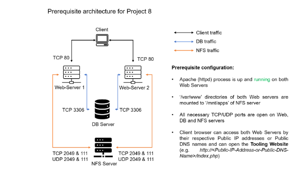

# Load-Balancer-Solution-With-APACHE

This project is a continuation of project 7( Devops-Tooling-Website-Solution) 
After completing Project-7 it is possible to wonder how a user will have access to each of the webservers using 3 different IP addresses or 3 different DNS names. You might also wonder what is the point of having 3 different servers doing exactly the same thing.
When we access a website in the Internet we use a [URL](https://en.wikipedia.org/wiki/URL) and we do not really know how many servers are out there serving our requests, this complexity is hidden from a regular user, but in the case of websites that are being visited by millions of users per day (like Google or Reddit), it is impossible to serve all the users from a single Web Server (it is also applicable to databases, but for now we will not focus on distributed DBs).
Each URL contains a [domain name](https://en.wikipedia.org/wiki/Domain_name) part, which is translated (resolved) to the IP address of a target server that will serve requests when open a website in the Internet. Translation (resolution) of domain names is performed by [DNS servers,](https://en.wikipedia.org/wiki/Domain_Name_System) the most commonly used one has a public IP address 8.8.8.8 and belongs to Google. You can try to query it with [nslookup](https://en.wikipedia.org/wiki/Nslookup) command:

`nslookup 8.8.8.8`

When you have just one Web server and  there is a load increases – you want to serve more and more customers, you can add more CPU and RAM or completely replace the server with a more powerful one – this is called ***"vertical scaling".*** This approach has limitations – at some point, you reach the maximum capacity of CPU and RAM that can be installed into your server.
Another approach used to cater for increased traffic is ***"horizontal scaling"*** – distributing the load across multiple Web servers. This approach is much more common and can be applied almost seamlessly and almost infinitely (you can imagine how many server Google has to serve billions of search requests).
Horizontal scaling allows adapting to the current load by adding ***(scale out)*** or removing ***(scale in)*** Web servers. Adjustment of a number of servers can be done manually or automatically (for example, based on some monitored metrics like CPU and Memory load).
The property of a system (in our case it is Web tier) to be able to handle the growing load by adding resources, is called ["Scalability".](https://en.wikipedia.org/wiki/Scalability)
In our set-up in Project-7, we had 3 Web Servers and each of them had its own public IP address and public DNS name. A client has to access them by using different URLs, which is not a nice user experience to remember the addresses/names of even 3 servers, let alone millions of [Google servers.](https://en.wikipedia.org/wiki/Google_data_centers)
In order to hide all this complexity and to have a single point of access with a single public IP address/name, a [Load Balancer](https://en.wikipedia.org/wiki/Load_balancing_(computing)) can be used.  A Load Balancer (LB) distributes clients’ requests among underlying Web Servers and makes sure that the load is distributed in an optimal way.

Side Self-Study:
Read about different [Load Balancing concepts](https://www.nginx.com/resources/glossary/load-balancing/) and differences between [L4 Network  LB](https://www.nginx.com/resources/glossary/layer-4-load-balancing/) and [L7 Application LB](https://www.nginx.com/resources/glossary/layer-7-load-balancing/).

Let us take a look at the updated solution architecture with an LB added on top of Web Servers (for simplicity let us assume it is a software L7 Application LB, for example – [Apache,](https://httpd.apache.org/docs/2.4/mod/mod_proxy_balancer.html) [NGINX](https://docs.nginx.com/nginx/admin-guide/load-balancer/http-load-balancer/) or [HAProxy](http://www.haproxy.org/)

In this project, we will enhance our Tooling Website solution by adding a Load Balancer to distribute traffic between Web Servers and allow users to access our website using a single URL.

### Task

Deploy and configure an Apache Load Balancer for Tooling Website solution on a separate Ubuntu EC2 instance. Make sure that users can be served by Web servers through the Load Balancer.
To simplify, let us implement this solution with 2 Web Servers, the approach will be the same for 3 and more Web Servers.
### Prerequisites

Make sure that you have the following servers installed and configured within Project-7:
- Two RHEL8 Web Servers
- One MySQL DB Server (based on Ubuntu 20.04)
- One RHEL8 NFS server

### Configure Apache As A Load Balancer

- Create an Ubuntu Server 20.04 EC2 instance and name it ***Project-8-apache-lb,*** so your EC2 list will look like this:

- Open TCP port 80 on Project-8-apache-lb by creating an Inbound Rule in the Security Group

- Install Apache Load Balancer on ***Project-8-apache-lb server*** and configure it to point traffic coming to LB to both Web Servers:

#Install apache2

`sudo apt update`

`sudo apt upgrade`

`sudo apt install apache2 -y`

`sudo apt-get install libxml2-dev`

### Enable the following modules:

`sudo a2enmod rewrite`

`sudo a2enmod proxy`

`sudo a2enmod proxy_balancer`

`sudo a2enmod proxy_http`

`sudo a2enmod headers`

`sudo a2enmod lbmethod_bytraffic`

### Restart apache2 service

`sudo systemctl restart apache2`

- Make sure apache2 is up and running

`sudo systemctl status apache2`

### Configure load balancing

Go into apaches default configuration file 

`sudo vi /etc/apache2/sites-available/000-default.conf`

### Restart apache server
`sudo systemctl restart apache2`

[Bytraffic](https://httpd.apache.org/docs/2.4/mod/mod_lbmethod_bytraffic.html) balancing method will distribute the incoming load between your Web Servers according to the current traffic load. We can control in which proportion the traffic must be distributed by loadfactor parameter.
You can also study and try other methods, like [bybusyness,](https://httpd.apache.org/docs/2.4/mod/mod_lbmethod_bybusyness.html) [byrequests,](https://httpd.apache.org/docs/2.4/mod/mod_lbmethod_byrequests.html) [heartbeat](https://httpd.apache.org/docs/2.4/mod/mod_lbmethod_heartbeat.html)

- Verify that our configuration works – try to access your LB’s public IP address or Public DNS name from your browser:

`http://<Load-Balancer-Public-IP-Address-or-Public-DNS-Name>/index.php`

In [Project-7](https://github.com/Jobijollof/Devops-Tooling-Website-Solution) we mounted /var/log/httpd/ from our Web Servers to the NFS server – We will have to unmount them and make sure that each Web Server has its own log directory.

- Connect to Web Servers and run the following command:

`sudo tail -f /var/log/httpd/access_log`

Try to refresh your browser page http://(Load-Balancer-Public-IP-Address-or-Public-DNS-Name)/index.php several times and ensure both servers receive HTTP GET requests from your LB. New records must appear in each server’s log file. The number of requests to each server will be approximately the same since we set load factor to the same value for both servers – it means that traffic will be distributed evenly between them.
If you have configured everything correctly – your users will not even notice that their requests are served by more than one server.

***Side Self-Study:***
Read more about different configuration aspects of [Apache](https://httpd.apache.org/docs/2.4/mod/mod_proxy_balancer.html) [Mod_proxy_balancer module.](https://httpd.apache.org/docs/2.4/mod/mod_proxy_balancer.html) Understand what ***sticky session*** means and when it is used.

### Optional Step – Configure Local DNS Names Resolution
Sometimes it is tedious to remember and switch between IP addresses, especially if we have a lot of servers under our management.
What we can do, is to configure local domain name resolution. The easiest way is to use ***/etc/hosts*** file, although this approach is not very scalable, it is very easy to configure and shows the concept well. So let us configure the IP address to domain name mapping for our LB.

Open this file on your LB server

`sudo nano /etc/hosts`

#Add 2 records into this file with the Local IP address and arbitrary name for both of your Web Servers

<WebServer1-Private-IP-Address> Web1
<WebServer2-Private-IP-Address> Web2

We will update the LB config file with those names instead of IP addresses.
BalancerMember http://Web1:80 loadfactor=5 timeout=1
BalancerMember http://Web2:80 loadfactor=5 timeout=1

We will curl our Web Servers from LB locally curl http://Web1 or curl http://Web2.

Please note that, this is only an internal configuration and it is also local to our LB server, these names will neither be ‘resolvable’ from other servers internally nor from the Internet.
### Target Architecture

Now our set-up looks like this:

