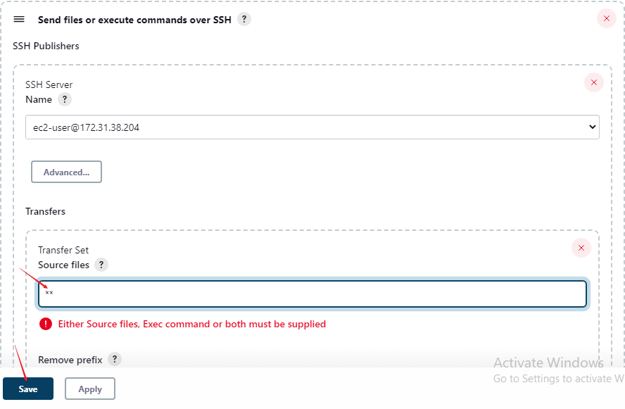
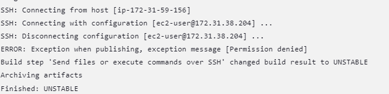

# Introduction To Jenkins

Tooling  Website Deployment and Automation With Continuous Integration

In Project-8 we introduced the ***horizontal scaling concept***, which allows us to add new Web Servers to our Tooling Website. 
We have successfully deployed a set-up with 2 Web Servers and a Load Balancer to distribute traffic between them.  
Assuming this setup is made up of just two or three servers then managing and configuring them manually will not be a big deal.
Imagine repeating the same task in order to add dozens or even hundreds of servers.

DevOps is about Agility and the speedy release of software and web solutions. One of the ways to guarantee fast and repeatable deployments is the Automation of routine tasks

In this project, we are going to start automating part of our routine tasks with a free and open-source automation server [Jenkins.](https://en.wikipedia.org/wiki/Jenkins_(software)) It is one of the most popular [CI/CD](https://en.wikipedia.org/wiki/CI/CD)tools, it was created by a former Sun Microsystems developer Kohsuke Kawaguchi and the project originally had a named "Hudson".

According to Circle CI, Continuous integration (CI) is a software development strategy that increases the speed of development while ensuring the quality of the code that teams deploy. Developers continually commit code in small increments (at least daily, or even several times a day), which is then automatically built and tested before it is merged with the shared repository.

In our project we are going to utilize Jenkins CI capabilities to make sure that every change made to the source code in GitHub https://github.com will  automatically be updated to the Tooling Website.

***Side Self Study***
Read about [Continuous Integration, Continuous Delivery and Continuous Deployment.](https://circleci.com/continuous-integration/)

### Task
Enhance the architecture prepared in Project 8 by adding a Jenkins server, and configuring a job to automatically deploy source code changes from Git to the NFS server.
Here is what your updated architecture will look like upon completion of this project:


## INSTALL AND CONFIGURE JENKINS SERVER

### Step 1 – Install the Jenkins server

- Create an AWS EC2 server based on Ubuntu Server 20.04 LTS and name it "Jenkins"

- Install [JDK](https://en.wikipedia.org/wiki/Java_Development_Kit) (since Jenkins is a Java-based application)

`sudo apt update`

`sudo apt install default-jdk-headless -y`
### Install Jenkins

```
wget -q -O - https://pkg.jenkins.io/debian-stable/jenkins.io.key | sudo apt-key add -
sudo sh -c 'echo deb https://pkg.jenkins.io/debian-stable binary/ > \
    /etc/apt/sources.list.d/jenkins.list'

```    
`sudo apt update`

I had errors at this point.


i did a bit of research, and got that this error typically occurs when trying to update or install packages from a repository that has not been authenticated. The error message suggests that the public key needed to authenticate the repository is not available on your system.

To resolve this issue, i ran the following command:

`sudo apt-key adv --keyserver keyserver.ubuntu.com --recv-keys 5BA31D57EF5975CA`


`sudo apt upgrade -y`

`sudo apt-get install jenkins -y`

Make sure Jenkins is up and running:

`sudo systemctl status jenkins`


By default Jenkins server uses TCP port 8080 – open it by creating a new Inbound Rule in your EC2 Security Group


### Perform initial Jenkins setup.

From your browser access http://<Jenkins-Server-Public-IP-Address-or-Public-DNS-Name>:8080
You will be prompted to provide a default admin password


Retrieve it from your server:

`sudo cat /var/lib/jenkins/secrets/initialAdminPassword`

Then you will be asked which plugins to install – choose suggested plugins.


Once plugin installation is done – create an admin user and you will get your Jenkins server address.
The installation is completed!


After creating new user, click on save and continue.


### Step 2 – Configure Jenkins to retrieve source codes from GitHub using Webhooks
In this part, you will learn how to configure a simple Jenkins job/project (these two terms can be used interchangeably). This job will be triggered by GitHub [webhooks](https://en.wikipedia.org/wiki/Webhook) and will execute a ‘build’ task to retrieve codes from GitHub and store it locally on Jenkins server.

- Enable webhooks in your GitHub repository settings

- Fork this [repo](https://github.com/Jobijollof/tooling)

- Click on settings 


- Rename repo to tooling

- Click on Webhook


- Add webhook


Go to Jenkins web console, click "New Item" and create a "Freestyle project"


- Click on configure on the left:

- Click on  git source code management and place the Url of the repo that was forked(tooling)


- Apply and save.

At this point i got an error.


To clear this error we have to grant permission.

- Go to Jenkins Dashboard

- Click on `Manage Jenkins`

- Click on `Configure global Security`

We have to enable `proxy compatibility` in ***CRF PROTECTION***


`Save` and `Apply`

Save the configuration and let us try to run the build. For now, we can only do it manually.
Click the "Build Now" button, if you have configured everything correctly, the build will be successful and you will see it under #1


You can open the build and check in "Console Output" if it has run successfully.
If so – congratulations! You have just made your very first Jenkins build!
But this build does not produce anything and it runs only when we trigger it manually. Let us fix it.


Click "Configure" your job/project and add these two configurations.


1. Configure triggering the job from the GitHub webhook:

- Build triggers choose


2. Configure "Post-build Actions" to archive all the files – files resulting from a build are called "artifacts".
 
 - Post Build


Now, go ahead and make some changes in any file in your GitHub repository ***(e.g. README.MD file)*** and push the changes to the master branch.
You will see that a new build has been launched automatically (by webhook) and you can see its results – artifacts, saved on the Jenkins server.


You have now configured an automated Jenkins job that receives files from GitHub by webhook trigger (this method is considered as ‘push’ because the changes are being ‘pushed’ and file transfer is initiated by GitHub). There are also other methods: trigger one job (downstream) from another (upstream), poll GitHub periodically and others.

By default, the artifacts are stored on the Jenkins server locally to check that,

`ls /var/lib/jenkins/jobs/job-name/builds/build_number/archive/`

`ls /var/lib/jenkins/jobs/project-tooling/builds/3/archive/`


## Configure Jenkins To Copy Files To NFS Server VIA SSH

### Step 3 – Configure Jenkins to copy files to NFS server via SSH

Now we have our artifacts saved locally on Jenkins server, the next step is to copy them to our NFS server to ***/mnt/apps*** directory.
Jenkins is a highly extendable application and there are 1400+ plugins available. We will need a plugin that is called ["Publish Over SSH".](https://plugins.jenkins.io/publish-over-ssh/)

### Install the "Publish Over SSH" plugin.

On the main dashboard select "Manage Jenkins" and choose the "Manage Plugins" menu item.

On the "Available" tab search for the "Publish Over SSH" plugin and install it


You will get an error:

HTTP ERROR 403 No valid crumb was included in the request

You have to install the plugin called "Strict Crumb Issuer"
Once installed restart the jenkins service.


### Configure the job/project to copy artifacts over to the NFS server.

On the main dashboard select "Manage Jenkins" and choose the "Configure System" menu item.
Scroll down to Publish over the SSH plugin configuration section and configure it to be able to connect to your NFS server:

- Provide a private key (the content of .pem file that you use to connect to the NFS server via SSH/Putty)
Arbitrary name
- Hostname – can be private IP address of your NFS server

- Username – ec2-user (since the NFS server is based on EC2 with RHEL 8)

- Remote directory – /mnt/apps since our Web Servers use it as a mounting point to retrieve files from the NFS server

- Test the configuration and make sure the connection returns Success. Remember, that TCP port 22 on NFS server must be open to receive SSH connections.


Save the configuration. 

open your Jenkins job/project configuration page and add another one "Post-build Action"




Save this configuration and go ahead, and change something in README.MD file in your GitHub Tooling repository.
Webhook will trigger a new job and in the "Console Output" of success, however, i got a build error. This was my console output




- Permission error. Connect to the NFS server and run the following commands

`sudo chown -R nobody:nobody /mnt`

`sudo chmod -R 777 /mnt`


To make sure that the files in /mnt/apps have been updated – connect via SSH/Putty to your NFS server and check README.MD file

`cat /mnt/apps/README.md`


